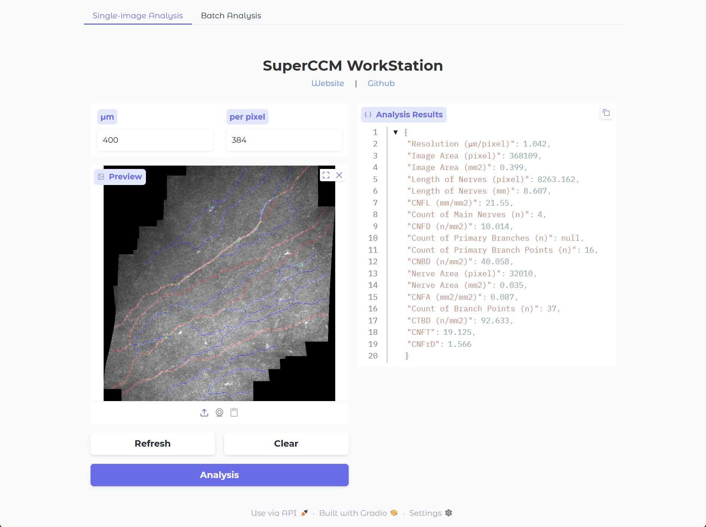

<div align="center">


---

# SuperCCM

**Open-Source Framework for Corneal Nerve Image Analysis**

[]()
[](https://github.com/qlnfm/SuperCCM)
[](https://pypi.org/project/superccm/)
[](./LICENSE)
[](https://doi.org/10.1167/tvst.14.11.27)

**[🔮Online Demo](https://huggingface.co/spaces/jugking6688/SuperCCM)** 
| **[💻Desktop App Download](https://github.com/qlnfm/SuperCCM/releases)**
| **[📖Documents](docs/document.md)**
| **[🚩Update Log](docs/update.md)**
</div>

---

## ❇️ Installation

```bash
# From PyPI
pip install superccm

# From Source
conda create -n superccm python=3.10 -y
conda activate superccm
pip install -r requirements.txt
````

---

## ⚡ Quick Start

```python
from superccm.api import analysis

metrics = analysis('your/img/path')
print(metrics)
```

### Launch the desktop app

```bash
python app.py
```

#### Preview



---


## 📄 License

This project is licensed under the [**GPL v3**](./LICENSE).
You are free to use, modify, and distribute it under the same terms.

---

## 🎓 Academic Reference

> Qiao, Qincheng et al. “SuperCCM: An Open Source Python Toolkit for Automated Quantification of Corneal Nerve Fibers in Confocal Microscopy Images.” Translational vision science & technology vol. 14,11 (2025): 27. doi:10.1167/tvst.14.11.27

---

<div align="center">

🧬 Made with ❤️ by the SuperCCM Team
💻 [https://github.com/qlnfm/SuperCCM](https://github.com/qlnfm/SuperCCM)

</div>
