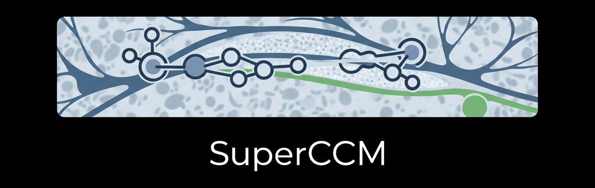

<div align="center">



---

# ✨ SuperCCM v1.0

**🧠 A Fully Open-Source Framework for Corneal Confocal Microscopy (CCM) Image Analysis**

[](https://github.com/qlnfm/SuperCCM)
[](https://pypi.org/project/superccm/)
[](./LICENSE)
[](https://www.python.org/)

**English** | [简体中文](./README_CN.md)

</div>

---

## 🚀 Overview

### 💡 What is SuperCCM? Why do we need it?

✨ **SuperCCM** is an **open-source Python framework** for analyzing corneal nerve images obtained from  
**Corneal Confocal Microscopy (CCM)**.  
Given a single CCM image, SuperCCM can automatically perform preprocessing, segmentation,  
and compute clinically relevant morphological parameters.

It also provides a **modular architecture**, allowing you to easily integrate your own algorithms  
(e.g., segmentation, denoising, or custom workflows).

🧩 **Scientific Motivation**  
Over the past 20 years, CCM-based corneal nerve morphology has proven to be a reliable biomarker  
for various **neurodegenerative** (e.g., diabetic neuropathy, Parkinson’s disease)  
and **ocular surface disorders** (e.g., dry eye).  
Existing tools like *CCMetrics*, *NeuronJ/ImageJ*, and *ACCMetrics* are either semi-automatic  
or closed-source.  
SuperCCM aims to provide a **transparent, efficient, and fully open** alternative for the community.

---

## 🔮 Online Demo

🎯 **Try it instantly on Hugging Face Spaces:**  
👉 [Run SuperCCM Web App](https://huggingface.co/spaces/jugking6688/SuperCCM-Web)

---

## ❇️ Installation

### 🧱 Option 1: From source

```bash
conda create -n superccm python=3.10 -y
conda activate superccm
pip install -r requirements.txt
````

### 📦 Option 2: From PyPI

```bash
pip install superccm
```

---

## ⚡ Quick Start

### ✅ Using the default workflow

```python
from superccm import DefaultWorkFlow

wf = DefaultWorkFlow()
metrics = wf.run('your/img/path')
print(metrics)
```

### 🧩 Shortcut (less formal)

```python
from superccm.api import analysis

metrics = analysis('your/img/path')
print(metrics)
```

### 🌐 Launch the local web app

```bash
python app.py
```

---

## 📖 Documentation

SuperCCM follows a **simple and modular design philosophy**,
making it easy for both users and developers to get started quickly.

* 📘 [Quick Tutorial](docs/doc1_en.md): Learn how to use SuperCCM step-by-step
* 🧠 [Module Development Guide](docs/doc2_en.md): Integrate your own algorithms into the framework

---

## 📄 License

This project is licensed under the [**GPL v3**](./LICENSE).
You are free to use, modify, and distribute it under the same terms.

---

## 🎓 Academic Reference

> 📢 Coming soon!
> Our manuscript has been accepted by **TVST** and will be available for citation soon.

---

<div align="center">

🧬 Made with ❤️ by the SuperCCM Team
💻 [https://github.com/qlnfm/SuperCCM](https://github.com/qlnfm/SuperCCM)

</div>
