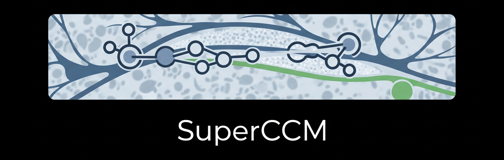

<div align="center">
  

<hr>

[English](./README.md) | 简体中文
</div>

### *SuperCCM Version 0.4.0*

## 🚀 简介

✨️SuperCCM是一个开源的，用于处理和分析角膜共聚焦显微镜(CCM)的角膜神经图像的Python框架。
通过输入一张CCM角膜神经图像，SuperCCM可以全自动的对图像进行处理，并输出各种临床中常用的形态学参数。
SuperCCM还允许快速、简单地将某个独立算法(例如分割等)集成到框架中。

### 🎆 Github: [https://github.com/qlnfm/SuperCCM](https://github.com/qlnfm/SuperCCM)

## 🔮 在线使用

### 🤗 Hugging Face: [https://huggingface.co/spaces/jugking6688/SuperCCM-Web](https://huggingface.co/spaces/jugking6688/SuperCCM-Web)

### 🏠 我们的网站: [http://aiccm.fun/](http://aiccm.fun/)

## ❇️ 环境准备

```shell
conda create -n superccm python=3.10 -y
conda activate superccm
pip install -r requirements.txt
```
 - 从PyPI安装
```shell
pip install superccm
```

## ⚡ 快速开始

```python
from superccm import DefaultWorkFlow

wf = DefaultWorkFlow()
metrics = wf.run('your/img/path')
print(metrics)
```
或者更简单但非正式的:
```python
from superccm.api import analysis

metrics = analysis('your/img/path')
print(metrics)
```
或者本地启用Web服务:
```shell
python app.py
```

## 📖 文档教程

SuperCCM秉承简洁的开发原则，使用户和开发者尽可能低成本、快速地入门和掌握。

 - ✨️ [简明教程](docs/doc1_cn.md): 深入了解SuperCCM的使用
 - ✨️ [模块编写](docs/doc2_cn.md): 学习如何自定义工作流，将您开发的算法整合到SuperCCM

## 📄 许可协议

本项目遵循[GPL v3](LICENSE)开源许可证。

## 🎓 学术引用

> coming soon ...
