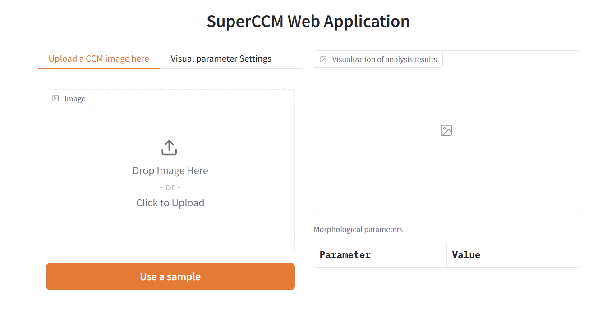
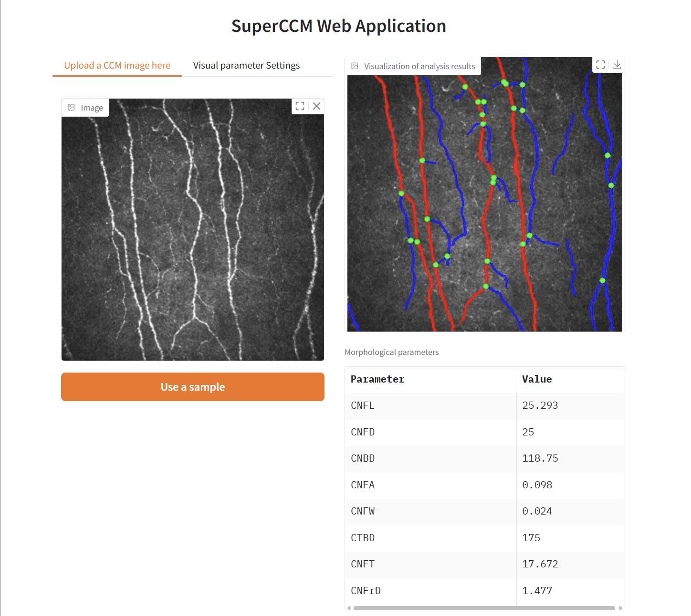

# 🎇 SuperCCM Quick Tutorial

## Preface

SuperCCM provides two ways of usage: **functional** and **object-oriented**.

Object-oriented:

```python
from superccm import DefaultWorkFlow

wf = DefaultWorkFlow()
metrics = wf.run('your/img/path')
print(metrics)
```

Functional:

```python
from superccm.api import analysis

metrics = analysis('your/img/path')
print(metrics)
```

## Reading Images

`SuperCCM.run` accepts multiple input formats, for example:

* **Local path**

```python
from superccm import DefaultWorkFlow

wf = DefaultWorkFlow()
metrics = wf.run('your/img/path')
print(metrics)
```

* **np.ndarray**

```python
from superccm import DefaultWorkFlow
import cv2

img = cv2.imread('your/img/path', 0)
wf = DefaultWorkFlow()
metrics = wf.run(img)
print(metrics)
```

* **PIL.Image**

```python
from superccm import DefaultWorkFlow
from PIL import Image

img = Image.open('your/img/path')
wf = DefaultWorkFlow()
metrics = wf.run(img)
print(metrics)
```

* **URL**

```python
from superccm import DefaultWorkFlow

img_url = 'https://www.yourimgurl.com/your/img/url'
wf = DefaultWorkFlow()
metrics = wf.run(img_url)
print(metrics)
```

## Result Visualization

SuperCCM provides a visualization method `draw`:

```python
from superccm import DefaultWorkFlow, draw

wf = DefaultWorkFlow()
file_path = 'your/img/path'
rst = wf.run(file_path)
print(rst)
image = draw(wf.graph)
image
```

Parameters of the `draw` method:

```text
    :param nerve_graph: NerveGraph object
    :param main_edge_color: Color of main nerve fibers
    :param side_edge_color: Color of side nerve fibers
    :param edge_body: Whether to display the full nerve fibers or just their skeleton
    :param show_main_edge: Whether to display main nerve fibers
    :param show_side_edge: Whether to display side nerve fibers
    :param end_node_color: Color of terminal nodes
    :param branch_node_color: Color of branching nodes
    :param show_end_node: Whether to display terminal nodes
    :param show_branch_node: Whether to display branching nodes
    :param background: For image background, choose 'Image' to use the original image,
                       or 'empty' for a pure black background
    :param branch_node_size: Radius of branch nodes (in pixels)
    :param end_node_size: Radius of terminal nodes (in pixels)
```

## Running the Web Application

1. Start the web service:

```shell
python app.py
```

Output:

```text
* Running on local URL:  http://127.0.0.1:7860
```

2. Access the URL in your browser:

  

3. Upload an image:

  

