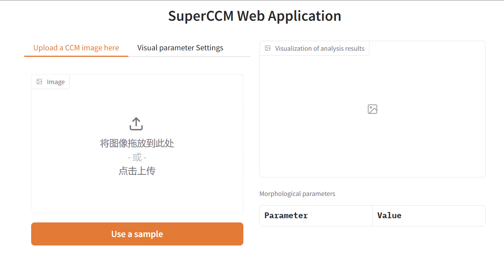

# 🎇SuperCCM 进阶教程

## 读取图片
在最初的快速开始中，我们了解到了:
```python
from superccm import SuperCCM

ccm = SuperCCM()
metrics = ccm.run('your/img/path')
print(metrics)
```
事实上，`SuperCCM.run`可以接受更多输入的格式，例如:
 - np.ndarray
```python
from superccm import SuperCCM
import cv2

img = cv2.imread('your/img/path', 0)
ccm = SuperCCM()
metrics = ccm.run(img)
print(metrics)
```
 - PIL.Image
```python
from superccm import SuperCCM
from PIL import Image

img = Image.open('your/img/path')
ccm = SuperCCM()
metrics = ccm.run(img)
print(metrics)
```
 - URL
```python
from superccm import SuperCCM

img_url = 'https://www.yourimgurl.com/your/img/url'
ccm = SuperCCM()
metrics = ccm.run(img_url)
print(metrics)
```

## 结果可视化
SuperCCM提供了将结果可视化的方法`draw`
```python
from superccm import SuperCCM, draw

superccm = SuperCCM()
file_path = 'your/img/path'
rst = superccm.run(file_path)
print(rst)
image = draw(superccm.graph)
image
```
`draw`方法的参数为:
```text
    :param 参数 nerve_graph: NerveGraph 对象
    :param 参数 main_edge_color: 主神经纤维的颜色
    :param 参数 side_edge_color: 侧神经纤维的颜色
    :param 参数 edge_body: 是否显示完整的神经纤维还是仅显示其骨架
    :param 参数 show_main_edge: 主神经纤维是否显示
    :param 参数 show_side_edge: 侧神经纤维是否显示
    :param 参数 end_node_color: 末端节点的颜色
    :param 参数 branch_node_color: 分支节点的颜色
    :param 参数 show_end_node: 是否显示末端节点
    :param 参数 show_branch_node: 是否显示分支节点
    :param 参数 background: 对于图像背景，选择 'Image' 可以使用原始图像作为背景，
    选择 'empty' 则使用纯黑色背景
    :param 参数 branch_node_size: 分支节点大小的半径（以像素为单位）
    :param 参数 end_node_size: 末端节点大小的半径（以像素为单位）
```

## 启用Web应用程序

1. 启动web服务

```shell
python app.py
```
Output:
```text
* Running on local URL:  http://127.0.0.1:7860
```

2. 通过浏览器访问url



3. 上传一张图片


