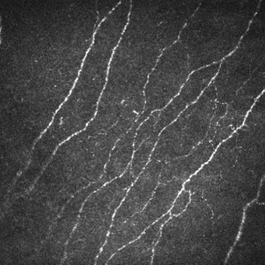

# Auto Analysis


1. Image Preparation

Prepare a [CCM corneal nerve fiber image](assets/auto_analysis/img.jpg).



2. Image Reading

Read the image using an appropriate method.
```python
import cv2
image = cv2.imread('assets/auto_analysis/img.jpg')
print(image.shape)
```
Output:
```text
(384, 384, 3)
```

3. Image Analysis

```python
from superccm import SuperCCM

ccm = SuperCCM()
metrics = ccm(image)
print(metrics)
```
Output:
```text
{'CNFL': 22.009, 'CNFD': 31.25, 'CNBD': 43.75, 'CNFA': 0.077, 'CNFW': 0.022, 'CTBD': 100.0, 'CNFT': 12.141, 'CNFrD': 1.428}
```