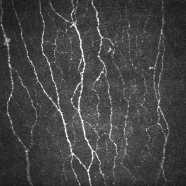
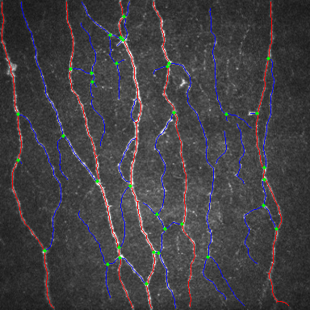

# Visualization


1. Image Preparation

Prepare a [CCM corneal nerve fiber image](assets/auto_analysis/img.jpg)。



2. Image Reading

Read the image using an appropriate method.
```python
import cv2
image = cv2.imread('assets/auto_analysis/img.jpg')
print(image.shape)
```
Output:
```text
(384, 384, 3)
```

3. Image visualization

```python
from superccm import SuperCCM, draw

ccm = SuperCCM()
ccm(image)
draw(ccm.nerve_image, ccm.nerve_graph)
```
Output:



