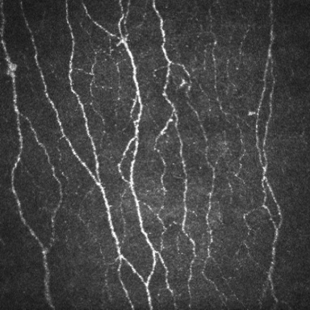
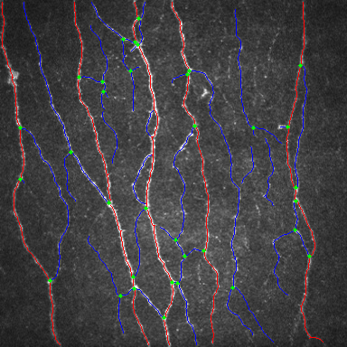

# 🎇 How SuperCCM Works

---

## 🧭 Summary

**SuperCCM** takes an image as input, returns all computed parameters, and optionally provides visualization:

| Parameter | Value  |
| :-------- | :----- |
| CNFL      | 34.361 |
| CNFD      | 31.25  |
| CNBD      | 181.25 |
| CNFA      | 0.137  |
| CNFW      | 0.025  |
| CTBD      | 300.0  |
| CNFT      | 15.224 |
| CNFrD     | 1.557  |

---

## 💎 How Are the Parameters Computed?

> ### ❗ Note
>
> When presenting the parameter values, please also report the version number of SuperCCM together, so that the results can be replicated and compared.
> 
> **Current Version: 1.0**

### 1. CNFL

CNFL is the total length of all nerve fibers.
An image is processed through the segmentation module followed by the skeletonization module.
The total length is then computed on the skeletonized image.

> Two 4-connected pixels count as a distance of 1 pixel, while diagonally connected pixels count as √2 pixels.

### 2. CNFD

CNFD is the number of **main nerve fibers**.

> ### ❓ How are main nerve fibers determined?
>
> The TrunkModule in SuperCCM determines them based on the consistency of fiber intensity and tortuosity, and applies a minimum length threshold.

### 3. CNBD

CNBD is the number of primary branches, i.e., branch points on the main nerve fibers.

### 4. CNFA

CNFA is the total area of the nerve fibers, obtained by counting foreground pixels in the binarized segmentation map.

> ### ❗ Note
>
> CNFA is the only parameter whose computation differs from ACCMetrics.

### 5. CNFW

CNFW is the average width of the nerve fibers, computed as area divided by total length.

### 6. CNBD

CNBD represents the number of branch points in the nerve fibers.

### 7. CNFT

CNFT is the average tortuosity of all **main nerve fibers**, computed using the same method as TC in CCMetrics.

> For algorithm details, refer to [tc.py](../superccm/impl/metircs/tc.py)

### 8. CNFrD

CNFrD is the fractal dimension of the nerve fibers, computed using the box-counting method on the binarized segmentation image.

